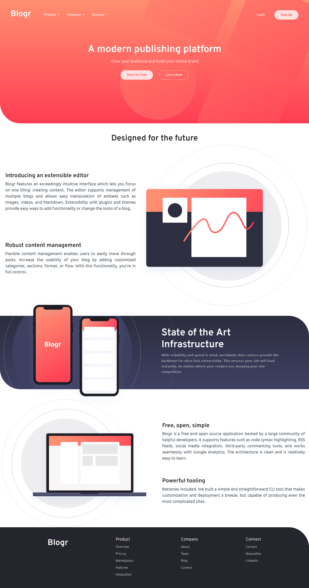

# Frontend Mentor - Blogr landing page solution

This is a solution to the [Blogr landing page challenge on Frontend Mentor](https://www.frontendmentor.io/challenges/blogr-landing-page-EX2RLAApP). Frontend Mentor challenges help you improve your coding skills by building realistic projects.

## Table of contents

- [Overview](#overview)
  - [The challenge](#the-challenge)
  - [Screenshot](#screenshot)
  - [Links](#links)
- [My process](#my-process)
  - [Built with](#built-with)
  - [What I learned](#what-i-learned)
  - [Continued development](#continued-development)
  - [Useful resources](#useful-resources)
- [Author](#author)
- [Acknowledgments](#acknowledgments)

## Overview

### The challenge

Users should be able to:

- View the optimal layout for the site depending on their device's screen size
- See hover states for all interactive elements on the page

### Screenshot

### Links

- Solution URL: [Add solution URL here](https://your-solution-url.com)
- Live Site URL: [Add live site URL here](https://your-live-site-url.com)

## My process

### Built with

- Semantic HTML5 markup
- CSS custom properties
- Bootstrap
- Desktop-first workflow

### What I learned

- Learned a lot about Bootstrap library
- One more step towards Improvement of responsive designing

### Continued development

- Continue focusing on HTML5, CSS3 & JavaScript.
- Still not completely comfortable with responsive designs.
- Still not completely comfortable with ES6 modules in JS.
- Might learn ReactJS for future projects.

### Useful resources

- [Bootstrap](https://www.bootstrap.com) - This helped me for styling reason. I really liked this pattern and will use it going forward.

## Author

- Frontend Mentor - [@riki8055](https://www.frontendmentor.io/profile/riki8055)
- Instagram - [@\_rit.ik\_](https://www.instagram.com/_rit.ik_)

## Acknowledgments

I want to thanks Frontend Mentor which provides such challenges to work on. Practice these challenges helped me improving my skills for frontend development. The challenges so far I've solved are fantastic and I really love to solve them!

I also appreciate Bootstrap library which helped me styling the markup and reducing my efforts to write lines of code in CSS.
